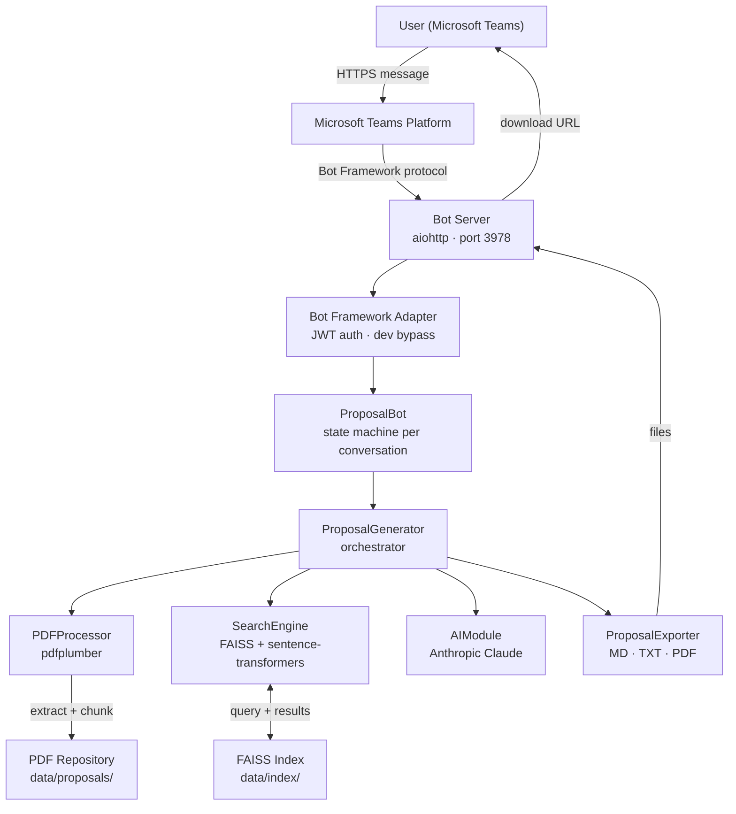
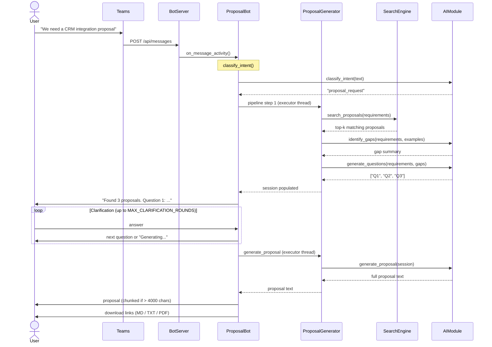
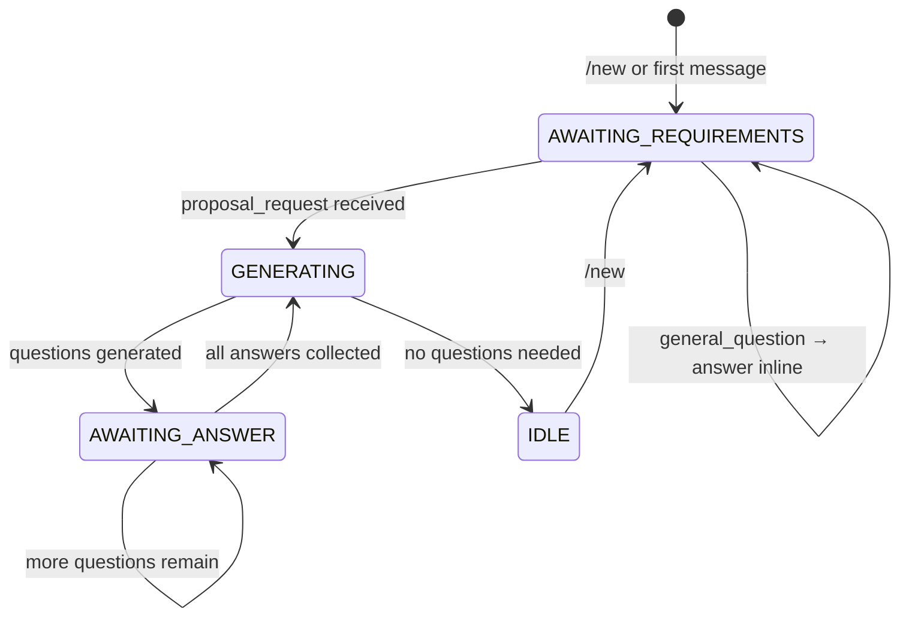
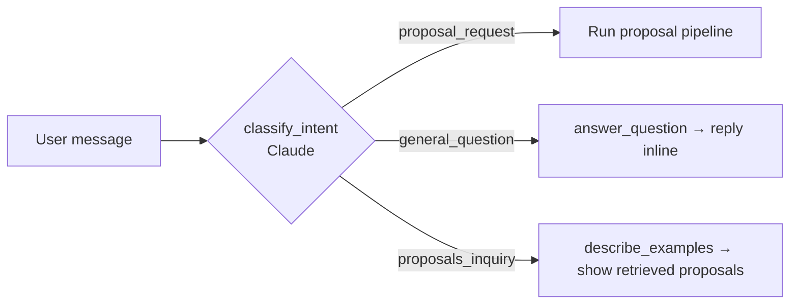
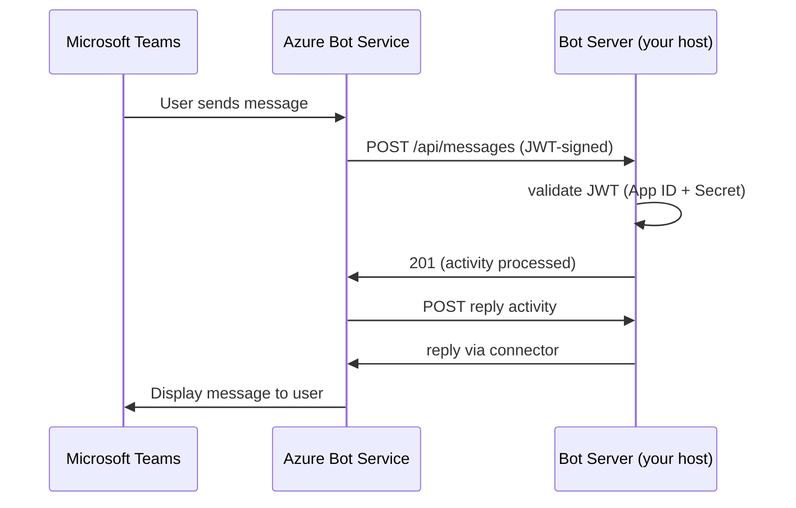

# Business Proposal AI Assistant

A Microsoft Teams bot that automates business proposal creation. It searches a repository of historical PDF proposals for relevant precedents, identifies gaps in new requirements, runs a targeted clarification dialogue, and generates a complete, annotated proposal document — all within a Teams conversation.

---

## Table of Contents

1. [Purpose](#purpose)
2. [System Architecture](#system-architecture)
3. [Request Flow](#request-flow)
4. [Component Design](#component-design)
5. [Teams Integration](#teams-integration)
6. [Project Structure](#project-structure)
7. [Local Setup & Testing](#local-setup--testing)
8. [Production Deployment](#production-deployment)
9. [Configuration Reference](#configuration-reference)
10. [Running Tests](#running-tests)
11. [Annotation Legend](#annotation-legend)

---

## Purpose

Business proposal writing is repetitive and knowledge-intensive. Analysts spend hours locating past proposals for reference, identifying what information is missing, and drafting structured documents. This system compresses that process:

- **Search**: Semantically match new requirements against a library of historical PDF proposals.
- **Gap Analysis**: Use Claude to identify what information is absent or ambiguous compared to similar past work.
- **Clarification**: Ask the user targeted questions — only what is actually missing, up to a configurable limit.
- **Generation**: Produce a full, structured business proposal. Sections where data is uncertain are annotated `[REVIEW NEEDED: <reason>]` so reviewers know exactly what to verify.
- **Download**: Retrieve the generated proposal as Markdown, plain text, or PDF.

The system is designed as a Microsoft Teams bot. The Teams conversation is the only interface — there is no separate web UI.

---

## System Architecture



### Layers

| Layer | Responsibility |
|---|---|
| **Transport** | aiohttp HTTP server receives POST requests from Teams via Bot Framework protocol |
| **Adapter** | `_Adapter(BotFrameworkAdapter)` handles auth, creates `TurnContext`, routes to bot |
| **Bot** | `ProposalBot` manages per-conversation session state and drives the conversation |
| **Orchestrator** | `ProposalGenerator` coordinates the three pipeline components |
| **PDF Processor** | Extracts text from PDFs, splits into overlapping word-count chunks |
| **Search Engine** | Encodes chunks with `sentence-transformers`, stores in FAISS, returns top-k results |
| **AI Module** | Calls Claude for intent classification, gap analysis, question generation, proposal writing |
| **Exporter** | Saves the final proposal as `.md`, `.txt`, and `.pdf` and makes them available for download |

---

## Request Flow

### Full Proposal Pipeline



### Conversation State Machine



### Intent Classification



---

## Component Design

### PDFProcessor

Reads every PDF in `data/proposals/` using `pdfplumber`. Text is split into overlapping chunks by word count (default: 800 words, 100-word overlap). Each chunk carries its source filename and page number for result attribution.

### SearchEngine

On first run, encodes all chunks with `sentence-transformers` (`all-MiniLM-L6-v2`) and stores them in a FAISS `IndexFlatIP` (inner-product) index. Vectors are L2-normalised before insertion so inner product equals cosine similarity. The index and chunk metadata are persisted to `data/index/` so they survive restarts. ML dependencies (`faiss`, `sentence-transformers`) are loaded lazily at first use to avoid Windows virtual memory exhaustion at import time.

### AIModule

Wraps the Anthropic SDK. Every method is a single, focused prompt:

| Method | Purpose | Max tokens |
|---|---|---|
| `classify_intent` | Classify message as `proposal_request`, `proposals_inquiry`, or `general_question` | 15 |
| `identify_gaps` | Compare new requirements against retrieved examples and list missing information | 1024 |
| `generate_questions` | Produce numbered clarification questions for the identified gaps | 1024 |
| `answer_question` | Respond conversationally to a general question in proposal context | 512 |
| `describe_examples` | Summarise retrieved proposals with relevance scores and excerpts | 512 |
| `generate_proposal` | Write a full structured proposal with `[REVIEW NEEDED]` annotations | 4096 |

### ProposalBot

Maintains a `UserSession` per Teams conversation ID. Sessions are in-memory — they reset when the server restarts. Blocking work (ML inference, Claude API calls) runs in a thread-pool executor to avoid blocking the aiohttp event loop.

### ProposalExporter

After generation, saves the proposal text to a temp directory keyed by session ID. The aiohttp server exposes `/download/{session_id}/{md|txt|pdf}` routes. The PDF renderer uses `fpdf2` with Markdown heading detection for basic structure.

---

## Teams Integration

### How the Bot Connects to Teams



In **development mode** (no `TEAMS_APP_ID` set), the adapter bypasses JWT validation and posts replies directly to the Bot Framework Emulator over HTTP — no Azure account required.

In **production mode** (`TEAMS_APP_ID` + `TEAMS_APP_PASSWORD` set), the standard Bot Framework auth flow is used. The server must be reachable over HTTPS.

---

## Project Structure

```
WPBrigade/
│
├── src/
│   ├── __init__.py
│   ├── ai_module.py          # Claude API wrapper — all AI logic
│   ├── pdf_processor.py      # PDF extraction and chunking
│   ├── proposal_exporter.py  # MD / TXT / PDF file generation for downloads
│   ├── proposal_generator.py # Pipeline orchestrator
│   ├── search_engine.py      # FAISS semantic search
│   ├── teams_bot.py          # Bot conversation logic and state machine
│   └── teams_server.py       # aiohttp server, Bot Framework adapter
│
├── scripts/
│   ├── build_index.py             # Build or rebuild the FAISS search index
│   └── create_sample_proposals.py # Generate sample PDFs for testing
│
├── tests/
│   ├── test_ai_module.py
│   ├── test_pdf_processor.py
│   ├── test_proposal_generator.py
│   ├── test_search_engine.py
│   └── test_teams_bot.py
│
├── teams_manifest/
│   └── manifest.json         # Teams app manifest for deployment
│
├── data/
│   ├── proposals/            # Place your PDF proposal library here
│   └── index/                # Auto-generated FAISS index (do not edit)
│
├── config.py                 # All configuration, loaded from .env
├── requirements.txt
├── .env.example
└── README.md
```

---

## Local Setup & Testing

### Prerequisites

- Python 3.10 or later
- [Bot Framework Emulator](https://github.com/microsoft/BotFramework-Emulator/releases) (for Teams bot testing without Azure)
- An Anthropic API key

### Step 1 — Install Dependencies

```bash
pip install -r requirements.txt
```

### Step 2 — Configure Environment

```bash
cp .env.example .env
```

Open `.env` and set your Anthropic API key:

```
ANTHROPIC_API_KEY=sk-ant-...
```

Leave `TEAMS_APP_ID` and `TEAMS_APP_PASSWORD` blank for local development. The server automatically enters development mode when these are absent.

### Step 3 — Add Proposals and Build the Index

Place PDF proposal files in `data/proposals/`. To generate sample PDFs for testing:

```bash
python scripts/create_sample_proposals.py
```

Then build the search index:

```bash
python scripts/build_index.py
```

This creates `data/index/faiss.index` and `data/index/chunks.pkl`. Re-run this script any time you add or remove PDFs.

### Step 4 — Start the Bot Server

```bash
python -m src.teams_server
```

You should see:

```
INFO  Starting on port 3978
INFO  Mode: development
INFO  Loading proposal index...
INFO  Bot ready. Index ready: True
```

### Step 5 — Test with Bot Framework Emulator

1. Open Bot Framework Emulator.
2. Click **File > Open Bot**.
3. Set the bot URL to `http://127.0.0.1:3978/api/messages`.
4. Leave **App ID** and **Password** blank.
5. Click **Connect**.

> **Note**: Use `127.0.0.1`, not `localhost`. On Windows, `localhost` resolves to IPv6 (`::1`) but the server binds to IPv4.

**Test the full flow:**

| Step | What to type | Expected result |
|---|---|---|
| 1 | *(connect)* | Welcome message with command list |
| 2 | `/help` | Command reference |
| 3 | Describe proposal requirements | Confirmation + first clarification question |
| 4 | `/proposals` | Summary of retrieved proposals with relevance scores |
| 5 | Answer or `/skip` each question | Up to 3 questions, then "Generating..." |
| 6 | *(wait)* | Full proposal text, then download links |
| 7 | Open a download link in browser | `.md`, `.txt`, or `.pdf` file download |
| 8 | Ask a general question | Direct answer without triggering proposal pipeline |

---

## Production Deployment

### Step 1 — Register an Azure Bot (free F0 tier)

1. Go to [Azure Portal](https://portal.azure.com) > **Create a resource** > **Azure Bot**.
2. Choose **Multi Tenant** as the app type.
3. Set the **Messaging endpoint** to `https://<your-domain>/api/messages`.
4. After creation, go to **Configuration** and note the **App ID**.
5. Under **Manage > Certificates & secrets**, create a new client secret and copy it.

### Step 2 — Enable the Microsoft Teams Channel

In the Azure Bot resource, go to **Channels** > **Microsoft Teams** and enable it.

### Step 3 — Update Environment Variables

On your server, set:

```
TEAMS_APP_ID=<azure-bot-app-id>
TEAMS_APP_PASSWORD=<client-secret>
BOT_BASE_URL=https://<your-domain>
```

### Step 4 — Deploy the Server

The bot server is a standard Python ASGI/WSGI application. Deploy it to any host that supports Python and outbound HTTPS:

```bash
python -m src.teams_server
```

The server must be accessible over HTTPS on port 443 (or behind a reverse proxy). Bot Framework requires a valid TLS certificate — self-signed certificates are not accepted.

**Recommended hosting options**: Azure App Service, Render, Railway, a VPS with nginx + certbot.

### Step 5 — Package and Install the Teams App

1. Edit `teams_manifest/manifest.json` — replace `{{TEAMS_APP_ID}}` with your Azure Bot App ID.
2. Add two icon files to `teams_manifest/`:
   - `color.png` — 192 × 192 px, full colour
   - `outline.png` — 32 × 32 px, white with transparent background
3. Create a zip archive containing exactly these three files:
   ```
   manifest.json
   color.png
   outline.png
   ```
4. In Microsoft Teams, go to **Apps > Manage your apps > Upload a custom app** and upload the zip.

The bot is now available in Teams. Users can open a chat with it directly or add it to a channel.

---

## Configuration Reference

All settings are loaded from the `.env` file. See `.env.example` for a template.

| Variable | Default | Required | Description |
|---|---|---|---|
| `ANTHROPIC_API_KEY` | — | Yes | Anthropic API key for Claude |
| `CLAUDE_MODEL` | `claude-sonnet-4-6` | No | Claude model ID |
| `EMBEDDING_MODEL` | `all-MiniLM-L6-v2` | No | Sentence-transformers model for semantic search |
| `CHUNK_SIZE` | `800` | No | Words per PDF chunk |
| `CHUNK_OVERLAP` | `100` | No | Word overlap between consecutive chunks |
| `TOP_K_RESULTS` | `3` | No | Number of similar proposals to retrieve |
| `MAX_CLARIFICATION_ROUNDS` | `3` | No | Maximum clarification questions per session |
| `TEAMS_APP_ID` | *(blank)* | Production only | Azure Bot App ID — blank enables development mode |
| `TEAMS_APP_PASSWORD` | *(blank)* | Production only | Azure Bot client secret |
| `TEAMS_BOT_PORT` | `3978` | No | Port the bot server listens on |
| `BOT_BASE_URL` | `http://127.0.0.1:3978` | Production only | Public base URL for proposal download links |

---

## Running Tests

```bash
python -m pytest tests/ -v
```

All 13 tests run without network access or ML model downloads — AI and search dependencies are mocked.

---

## Annotation Legend

Generated proposals contain inline annotations where human review is required before the document is submitted:

| Annotation | Meaning |
|---|---|
| `[REVIEW NEEDED: data not provided]` | The user did not supply this information during the session |
| `[REVIEW NEEDED: assumed from examples]` | Value was inferred from historical proposals and may not apply |
| `[REVIEW NEEDED: verify figures]` | Budget, timeline, or quantity is an estimate requiring confirmation |

All other sections are generated from the requirements and clarification answers provided in the session.
